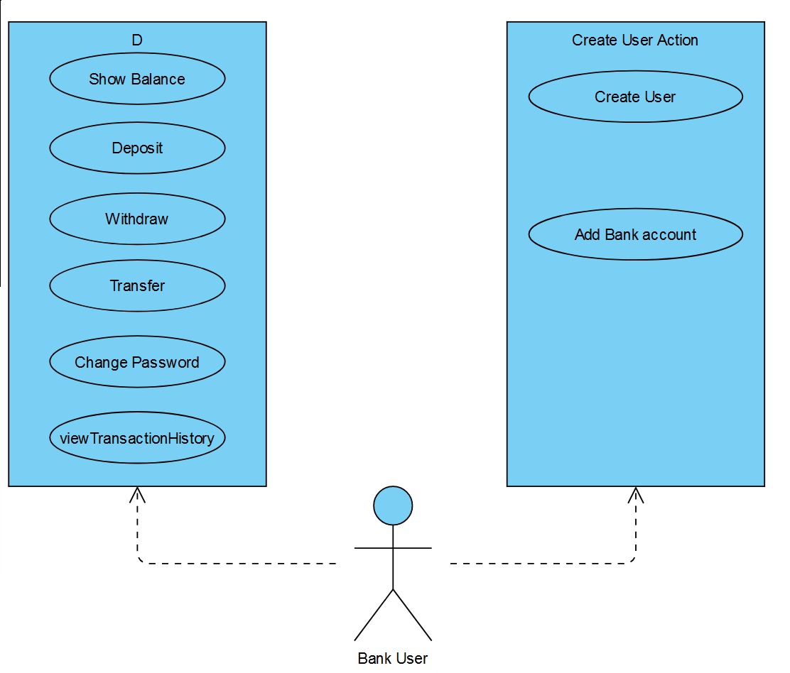

# Bank Application Project

This project is a simple bank application that allows users to create accounts,
perform transactions, and manage their balances. 
It consists of three main classes: `BankController`, `BankModel`, and `BankView`.

## Class Descriptions

### BankController
The `BankController` class is responsible for controlling the flow of the application. 
It handles user input, interacts with the model, and communicates with the view to 
display information and receive input from the user.

### BankModel
The `BankModel` class represents the data and business logic of the application. 
It manages user accounts, authentication, deposits, withdrawals, and transfers. 
It also provides methods to retrieve and store user data.

### BankView
The `BankView` class is responsible for the user interface. 
It displays menus, prompts, messages, and account details to the user.
It also collects user input for various operations.

## Testing

To ensure the correctness and functionality of the application,
unit tests have been implemented using the JUnit framework and Mock.
The `BankControllerTest` class contains test methods to verify the behavior of 
the `BankController`, `BankModel`, and `BankView` classes.

Mock classes, `MockBankModel` and `MockBankView`, have been used to simulate the behavior 
of the actual classes for testing purposes.
The mock classes allow capturing method invocations and providing expected responses.

## Running the Application

To run the bank application, execute the `BankController` through `Main` class.
It will start the application and display a menu for user interaction. 
Follow the prompts and make choices to perform different operations,
such as creating a user, logging in, checking balance, depositing, withdrawing, and transferring funds.
And also can run the Jar file in the 

### Back Log:

More Diagrams Ref: BackLog.pdf

### Usecase Diagram:

### Class Diagram

### Dependency Diagram

## Dependencies

This project has no external dependencies. 
It is implemented using Java standard libraries with Maven build tool.

## File Structure

The project files are organized as follows:

- `com.novare.bankApp.controller`: Contains the `BankController` class.
- `com.novare.bankApp.model`: Contains the `BankModel` class.
- `com.novare.bankApp.view`: Contains the `BankView` class.
- `test`: Contains the `BankControllerTest` class for unit testing.

## How to Contribute

If you would like to contribute to this project, please follow these steps:

1. Fork the repository.
2. Make your desired changes.
3. Test your changes to ensure they don't introduce any issues.
4. Create a pull request, describing the changes you have made.

Prerequisites
============
### - JDK 17.0.2
### - Maven [[Download](https://maven.apache.org/download.cgi) / [Install](https://maven.apache.org/install.html)]

