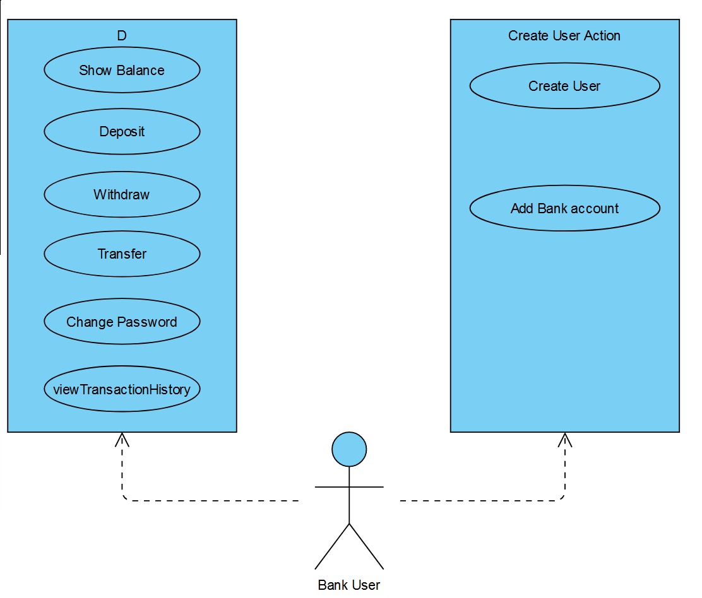
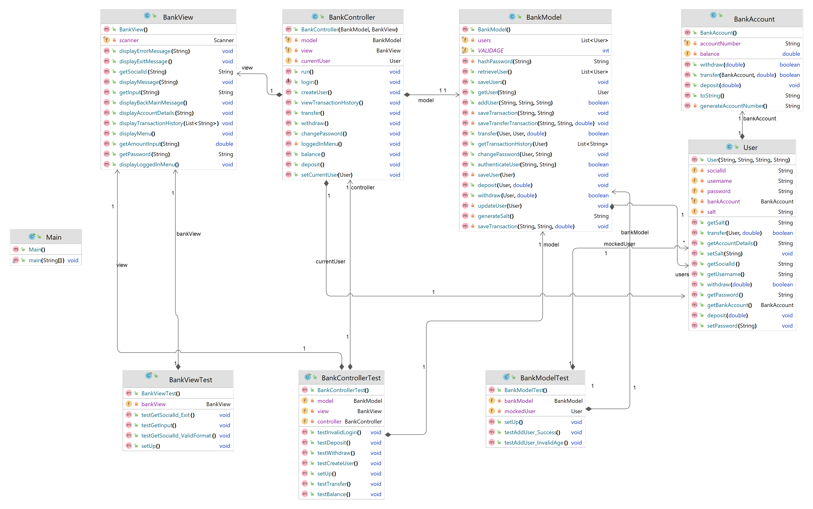
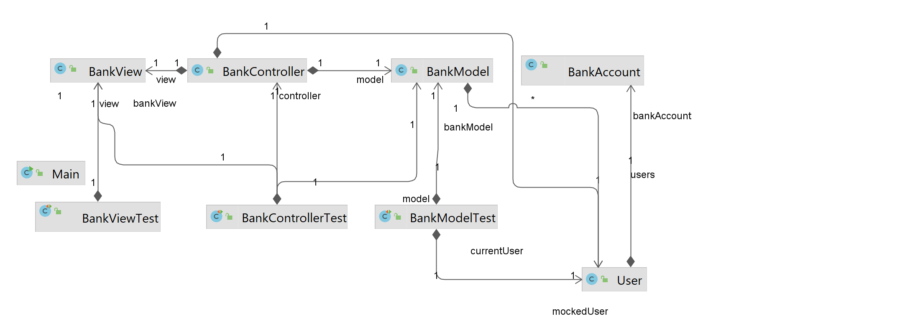

# Bank Application Project

This project is a simple bank application that allows users to create accounts,
perform transactions, and manage their balances. 
It consists of three main classes: `BankController`, `BankModel`, and `BankView`.

User account:

A user can be able to sign up to become a customer of the bank. In the signup process, the
customer have to provide a social security number and a password. Only a user that is
above 18 is allowed to sign up for an account. These credentials will be used for login into the
bank. A user can change their password after being logged in. 

The format which is used is as follows:

yyyy-abc

The ‘abc’ is any 3 alphabetic character combinations and it is case sensitive. For example:

1989-qwe

1999-ppe

2004-rtt

The Password must be at least 8 characters and contains at least 1 uppercase, 1 lowercase, and 1 number

Bank Account:

A bank account is consist of an amount, transaction history and an account number. The last
of which is unique. A bank account is connected to a user. The amount is not
allowed to go under zero. The account number will consist of 4 random numbers followed by a
short checksum value(this is a common feature for account- and card numbers).

Here follows an example on how to calculate generate a new account number:

• We generate 4 random numbers (1-9): 8 5 6 2

• We summaries these numbers to generate the checksum. 8 + 5 + 6 + 2 = 21

• We concatenate these numbers to generate the account number. Account number: 856221

Actions:

1-Balance: Display the current balance of the account.

2-Deposit: Update the account balance by adding the deposit amount.

3-Withdraw: Validate the availability of sufficient funds in the account and 
Update the account balance by deducting the withdrawal amount and check to prevent 
the account balance from going below zero.

4-Money Send:Validate the recipient's account number.Validate the availability of sufficient funds in the source account.
Update the account balances accordingly and check to prevent the amount from going below zero.

5-Transaction History:Retrieve the transaction history for a specific bank account and display the transaction history

6-Change Password: Implement validation of the current password against the stored value.Hash the new password using 
SHA256 with a salt value and Update the stored password with the new hashed value.

Data Storage:

Both of User signup and transactions stored in separate files and the users information stored in different
file for retrieving after each close of application so the app do not miss any user information.

## Class Descriptions

### BankController
The `BankController` class is responsible for controlling the flow of the application. 
It handles user input, interacts with the model, and communicates with the view to 
display information and receive input from the user.

### BankModel
The `BankModel` class represents the data and business logic of the application. 
It manages user accounts, authentication, deposits, withdrawals, and transfers. 
It also provides methods to retrieve and store user data.

### BankView
The `BankView` class is responsible for the user interface. 
It displays menus, prompts, messages, and account details to the user.
It also collects user input for various operations.

## Testing

To ensure the correctness and functionality of the application,
unit tests have been implemented using the JUnit framework and Mock.
The `BankControllerTest` class contains test methods to verify the behavior of 
the `BankController`, `BankModel`, and `BankView` classes.

Mock classes, `MockBankModel` and `MockBankView`, have been used to simulate the behavior 
of the actual classes for testing purposes.
The mock classes allow capturing method invocations and providing expected responses.

## Running the Application

"java -jar BankApp.jar

It will start the application and display a menu for user interaction. 
Follow the prompts and make choices to perform different operations,
such as creating a user, logging in, checking balance, depositing, withdrawing, and transferring funds.

### Back Log:

More Diagrams Ref: https://github.com/AlirezaKToosi/BankApp/blob/master/BackLog.pdf

### Usecase Diagram:

### Class Diagram

### Dependency Diagram

## Dependencies

This project has no external dependencies. 
It is implemented using Java standard libraries with Maven build tool.

## File Structure

The project files are organized as follows:

- `com.novare.bankApp.controller`: Contains the `BankController` class.
- `com.novare.bankApp.model`: Contains the `BankModel` class.
- `com.novare.bankApp.view`: Contains the `BankView` class.
- `test`: Contains the `BankControllerTest` class for unit testing.

## How to Contribute

If you would like to contribute to this project, please follow these steps:

1. Fork the repository.
2. Make your desired changes.
3. Test your changes to ensure they don't introduce any issues.
4. Create a pull request, describing the changes you have made.

Prerequisites
============
### - JDK 17.0.2
### - Maven [[Download](https://maven.apache.org/download.cgi) / [Install](https://maven.apache.org/install.html)]

